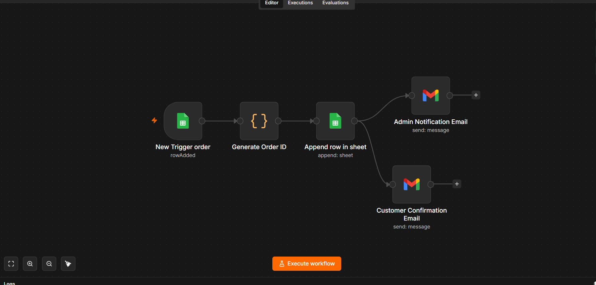
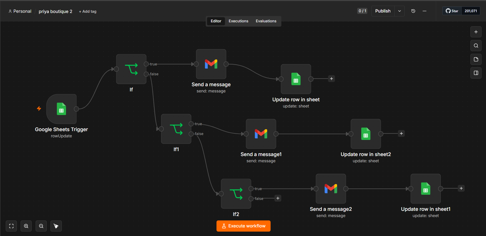
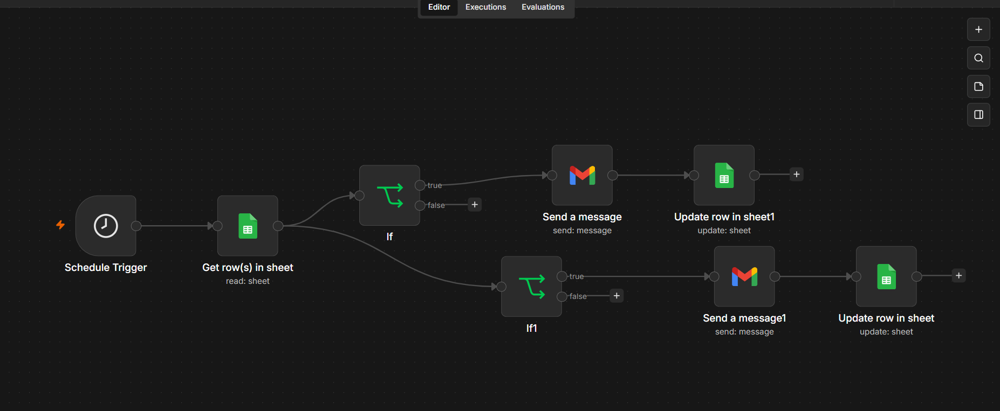

# Priya Boutique – E-commerce Order Automation

An end-to-end e-commerce order management automation system built with **n8n, Google Sheets, and Gmail**.

The system automates order creation, order-status notifications, payment and delivery follow-ups, customer communication, and admin notifications while maintaining email-sent tracking in Google Sheets.

## 🚀 Project Overview

Priya Boutique uses multiple n8n workflows to automate the lifecycle of an online order.

The workflows work together through **Google Sheets as the central order-management data layer**.

### System Architecture

```text
Customer / New Order
        │
        ▼
┌─────────────────────┐
│ New Order Workflow  │
└─────────┬───────────┘
          │
          ▼
   Google Sheets
          │
          ├───────────────┐
          │               │
          ▼               ▼
┌─────────────────┐ ┌─────────────────────┐
│ Order Status    │ │ Scheduled Monitoring│
│ Workflow        │ │ Workflow            │
└────────┬────────┘ └──────────┬──────────┘
         │                     │
         ▼                     ▼
       Gmail                 Gmail
    Notifications         Notifications
         │                     │
         └──────────┬──────────┘
                    ▼
              Google Sheets

🔄 Workflows
1. New Order Automation

File: new-order.json

Handles the creation and initial processing of a new order.

New Order Trigger
        ↓
Generate Order ID
        ↓
Append Order to Google Sheets
        ↓
   ┌────┴────┐
   ↓         ↓
Admin      Customer
Email      Confirmation
2. Order Status Automation

File: order-status.json

Handles customer notifications based on order status.

Supported statuses include:

Shipped
Delivered
Cancelled

The workflow checks whether the corresponding notification has already been sent before sending another email.

Google Sheets Trigger
        ↓
   Check Order Status
        ↓
 ┌──────┼──────────┐
 ↓      ↓          ↓
Shipped Delivered Cancelled
 ↓      ↓          ↓
Email   Email      Email
 ↓      ↓          ↓
Update Email-Sent Status
3. Scheduled Monitoring

File: scheduled-monitoring.json

Runs on a schedule, reads order records from Google Sheets, checks configured conditions, sends required notifications, and updates the corresponding email-sent fields.

Schedule Trigger
        ↓
Get Orders from Google Sheets
        ↓
Check Conditions
        ↓
Send Required Email
        ↓
Update Google Sheets

## 📸 Workflow Screenshots

### New Order Automation



### Order Status Automation



### Scheduled Monitoring



## 🔄 Workflows
🛠️ Technologies Used
n8n – Workflow automation
Google Sheets – Order data storage and tracking
Gmail – Automated customer and admin notifications
JavaScript Expressions – Conditional workflow logic
📊 Google Sheets Data

The order-management sheet contains fields such as:

Order ID
Order date
Customer name
Phone number
Email
Product
Quantity
Delivery address
Order status
Payment status
Tracking number
Payment email sent
Delivery email sent
Shipping email sent
Cancellation email sent

The email-sent fields are used to prevent duplicate notifications.

✨ Key Features
Automatic Order ID generation
Automated order creation and storage
Customer confirmation emails
Admin notification emails
Status-based customer notifications
Scheduled order monitoring
Duplicate-email prevention
Automatic Google Sheets updates
Centralized order tracking
End-to-end workflow automation
🔄 Example Order Lifecycle
New Order
   ↓
Generate Order ID
   ↓
Store Order in Google Sheets
   ↓
Customer Confirmation
   ↓
Order Shipped
   ↓
Shipping Notification
   ↓
Order Delivered
   ↓
Delivery Notification
📁 Repository Structure
priya-boutique-automation/
│
├── README.md
├── new-order.json
├── order-status.json
└── scheduled-monitoring.json
🔐 Security

The workflow exports in this repository should be configured with environment-specific credentials.

Never commit:

Passwords
API keys
OAuth client secrets
Access tokens
Private credentials

Credentials should be configured separately in the n8n environment.

🎯 Project Goal

The goal of this project is to demonstrate how workflow automation can streamline e-commerce operations, reduce repetitive manual tasks, improve customer communication, and maintain reliable order tracking with minimal manual intervention.
